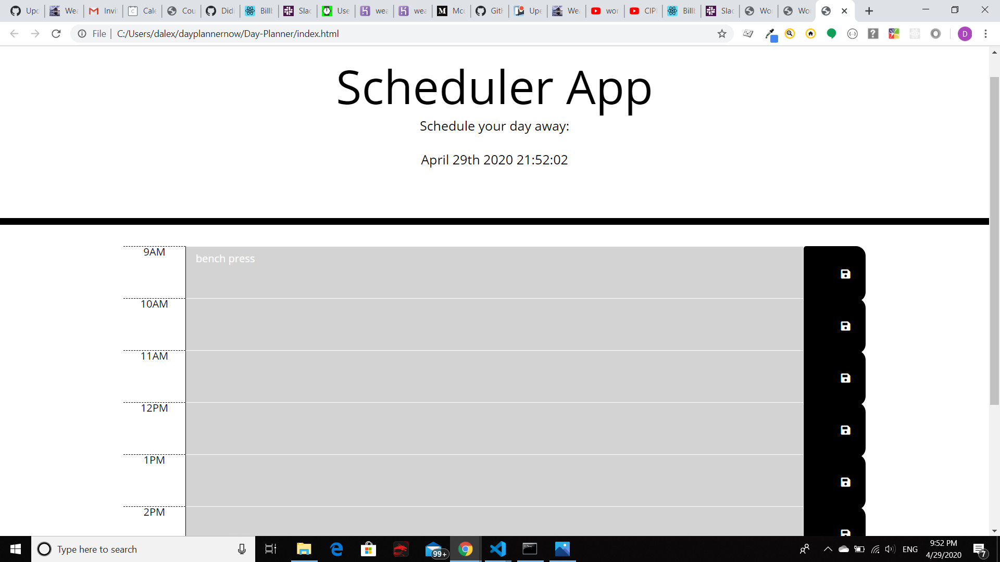

# PLANNER APPLICATION
 

 ## GitHub Repo

## Functionality
Successful planning is determining your to-dos for the day, then 
continually evaluate your progress as you complete your significant
milestone. This planner aims to aid users with real time Date in planning
accordingly, tracking your progress as the day evolves.

 

 
 

 
 

 

 
